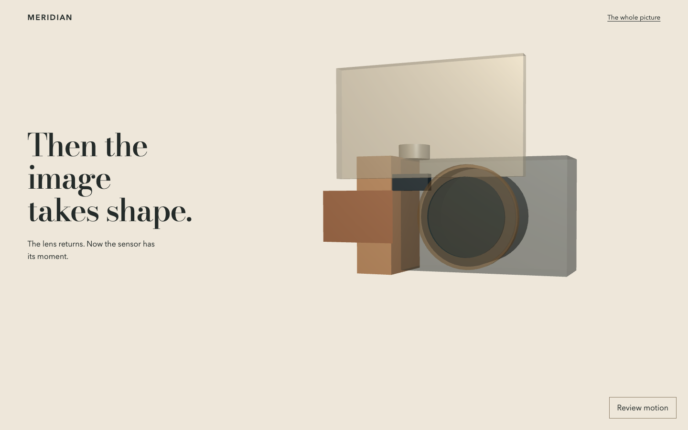
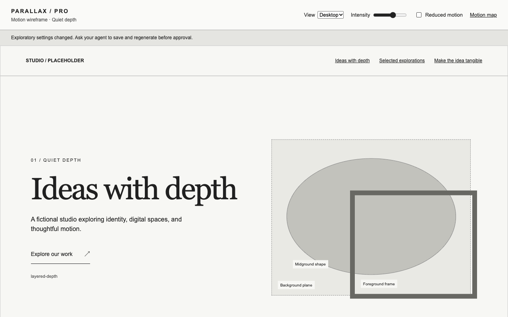
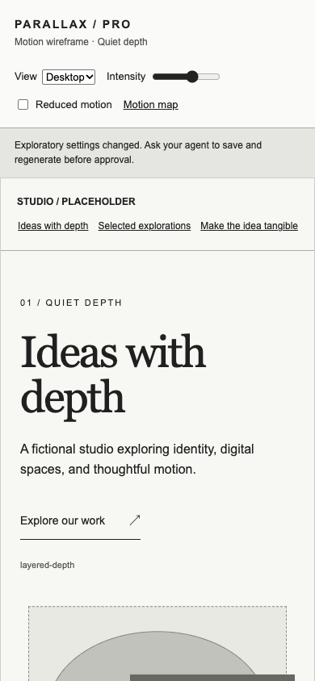
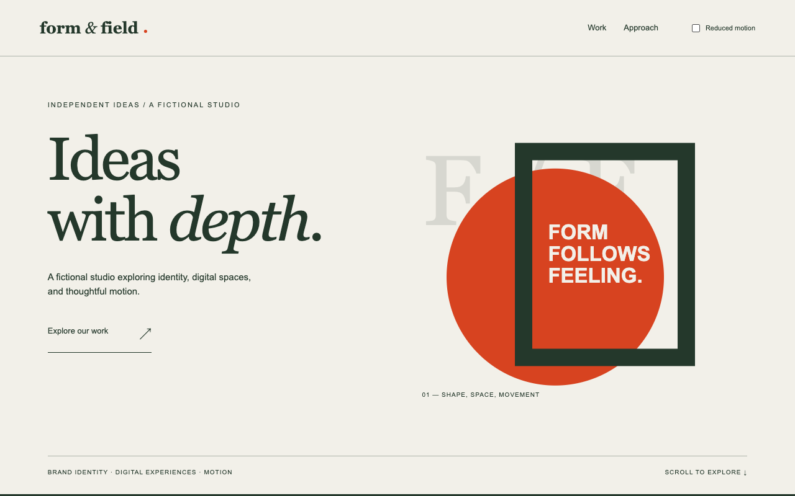

# Parallax Effect Pro

[](https://github.com/alvintayzhenwei/parallax-effect-pro/actions/workflows/ci.yml)
[](https://github.com/alvintayzhenwei/parallax-effect-pro/actions/workflows/security.yml)
[](https://github.com/alvintayzhenwei/parallax-effect-pro/actions/workflows/release.yml)
[](.github/dependabot.yml)
[](LICENSE)

Direct creative parallax stories with your coding agent. Compare three distinct narratives, inspect a representative motion preview, then integrate approved choreography into the UI owned by your chosen design tools.

**Development preview — visual and end-to-end acceptance are pending; npm publication is pending.** The repository stays private. Private workflow badges and screenshots may require GitHub authentication. Dependabot's label describes configuration; the linked workflow badges report actual run state, not guaranteed security.

## Continuous motion, version 2

One subject can persist across chapters: turn through 360 degrees, open, isolate a part, transfer the spotlight and reassemble. DOM/CSS handles persistent 2D actors; locally bundled Three.js handles real groups, cameras and lights. Preview and exported integration use the same deterministic timeline. Other UI/UX tools retain ownership of layout, typography, palette, components and forms.

[Open the fictional camera composite](examples/continuous-camera/index.html) after building locally. [Its authored story](examples/continuous-camera/story.json) produces [the MCP stage artifact](examples/continuous-camera/motion-r3.html) through the actual stdio tool. The procedural camera is conceptual, not final photography or engineering-accurate hardware. Mechanical checks do not establish owner creative acceptance.




### Step by step

1. Let your coding agent inspect the subject, existing site, assets and UI/UX decisions. Clarify discovery, reveal, climax and visitor action.
2. Ask for three different motion narratives. Choose or combine them before detailed assets or full implementation.
3. Start a version 2 record from `skills/parallax-effect-pro/templates/story.json`; replace its fictional example with your actual brief and chapters. Declare stage allocation, reading zones, persistent actors, fixed parents and numeric tracks.
4. Call `parallax_create_preview` with contained relative record/output paths. Inspect native scroll, key and transition poses, direct seek, reverse and mobile/static behavior. Save adjustments in the record and generate a new filename.
5. Record actual human approval for the exact revision/digest. `motion` approves only the stage. `integration` additionally binds the saved host-owned composite and reviewed context files; unseen site UI is not approved.
6. Call `parallax_export_handoff`. Version 2 produces Markdown plus an exclusive adjacent `.motion/` directory containing authored data, verified assets, local runtime and completion manifest. A partial error is not a complete export.
7. Mount with `ParallaxMotion.mountMotionStage(element, story, stageId, assets)`. Use `seek(progress)` with native scroll measurements; await `ready` and `dispose()` on teardown. Keep complete semantic content and host styles outside the mount. Review conservative projected bounds, clipping and reading-zone conflicts after resizing.
8. Review the actual integrated site and owner creative verdict before release/deployment. Existing-site and real Claude-host acceptance are separate evidence gates.

### Video prompts without a video MCP

Use the portable skill alone or ask the `assets` guidance phase for a [copyable video prompt pack](skills/parallax-effect-pro/templates/video-prompts.md). Tailor the subject, service, reveal, shot sequence, camera/subject motion, copy-safe region, continuity, loops, mobile crop, poster and export checklist. Choose Runway, Seedance, Higgsfield or another provider; verify its actual supported settings. [Camera-specific draft prompts](examples/continuous-camera/video-prompts.md) illustrate this route.

No account connection or provider call is required to prepare prompts. Direct generation is optional and requires applicable credit/cost approval. The stage currently imports reviewed PNG/JPEG/WebP and self-contained GLB; video playback or rendered frame sequences belong to the host stack. A generated movie does not provide detachable 3D parts.

Version 1 records and their historical previews remain supported without migration. The wireframe screenshots below document that earlier workflow; its separate-section recipes are not the version 2 creative ceiling.

## What you get

- A portable skill with source-backed parallax theory and guided discovery for nontechnical users.
- Three tailored concepts with a motion story, asset requirements and effort tradeoffs.
- Local animated visual previews with a clean site view, optional review controls, illustrative scenery, desktop/mobile views and reduced-motion fallback.
- A visual asset-route chooser and optional direct generation through your separately connected Runway MCP.
- Revision-bound motion or integration approval and exact-data runtime handoffs; legacy layout/motion records remain supported.
- A TypeScript CLI, local stdio MCP, Codex/Claude skill packages, a fictional complete-site example and release checks.

The MCP serves phase-specific guidance from the packaged skill, creates previews, and validates handoffs. The host model conducts the conversation and authors the final design; MCP does not run a model or guarantee aesthetic quality. Your coding agent writes the actual website in its existing stack, calls approved provider tools and performs approved deployment. It is not a hosted site builder or an autonomous publisher.





## Start from this private checkout

Requirements: Node.js 24+, npm, and Codex or Claude Code with local file access.

```sh
npm ci
npm run check
node dist/cli.js doctor
```

To try the fictional brief:

```sh
node dist/cli.js preview --root "$PWD" --record tests/fixtures/project.json --output previews/my-first-wireframe.html
```

Open the returned HTML path in your browser or host file preview. Scroll to inspect real motion. The clean site view opens first. Open review controls to try mobile view, intensity and reduced motion, or inspect the motion map and asset routes. No cloud calls or generation occur from the preview. Choose a fresh filename for each revision; existing files are preserved.

## Preview Mode: pinpoint a change

For a version 2 sample using only files shipped in the npm package, follow the [packaged preview guide](skills/parallax-effect-pro/templates/preview-review.md). From this checkout:

```sh
node dist/cli.js preview --root "$PWD" --record skills/parallax-effect-pro/templates/story.json --output previews/story-review-r1.html
```

Open the HTML, scroll to the stage you want to review, then select **Review motion**. Drag that stage's **Seek** slider to freeze a pose. Keyboard arrow keys adjust the slider. The displayed percentage identifies the stage-local motion point, not the percentage of the entire page. Select **Resume native scroll** to check the change in context and in reverse.

Give the agent feedback like this:

> Preview: story-review-r1.html; revision: paste the displayed revision; stage: paste the Seek label; pose: 62%; viewport: 1280 × 800. The foreground grass covers the enquiry text. Reduce its movement between 55% and 70%, preserve the villa/path relationship, and keep the approach before 55% unchanged. Show a new preview before integration.

Include the object, requested change, affected range, and what must stay fixed. The slider is a review aid: it does not save a change or grant approval. The agent edits the source record, generates a fresh filename, and checks the adjacent and reverse poses before requesting approval of the new revision. Use mobile and static/reduced-motion views too. Host-authored video previews may use different controls; include their filename and video time as well as scroll position.

### Latest visual study

The Tide & Timber study now explores a full-bleed, scroll-seeked owner-supplied video beneath site copy, rather than framed still images. Actual MCP asset/preview/build guidance was used; host HTML video APIs handle playback. Native MCP video import is not implemented. Frame decoding and seek-logic checks passed; live browser rendering, mobile cropping and owner visual acceptance remain pending. This study is local acceptance evidence, not a packaged demo or approved finished site.

The earlier without-MCP baseline used different media, so a comparison cannot isolate the MCP's contribution. Animated website capture is blocked by browser policy; no GIF comparison is claimed until genuine captures are available.

## Install skill and stdio tools

```sh
npm run build
npm run plugins
npm pack --ignore-scripts
```

Generated packages live in `plugins/parallax-effect-pro-codex` and `plugins/parallax-effect-pro-claude`. They share the canonical skill. The local tools are configured separately with an explicit project root. Follow [installation and host setup](docs/installation.md) for local tarball installation, Codex marketplace discovery, Claude `--plugin-dir`, and stdio configuration.

For a quick Claude session:

```sh
claude --plugin-dir /absolute/checkout/plugins/parallax-effect-pro-claude
```

For Codex:

```sh
codex plugin marketplace add /absolute/checkout/plugins
codex plugin add parallax-effect-pro@parallax-effect-pro
```

After installing the CLI, configure local tools for the selected project:

```sh
codex mcp add parallax-effect-pro -- parallax-effect-pro mcp --root /absolute/project
# Or, in Claude Code:
claude mcp add --transport stdio --scope local parallax-effect-pro -- parallax-effect-pro mcp --root /absolute/project
```

Restart/new chat where needed. Installation changes your host setup only when you run these commands. Use an absolute binary path if your host cannot find the installed CLI.

### After npm release

The following commands are future registry usage, **not available until publication**:

```sh
# Temporary execution:
npx --yes parallax-effect-pro@0.1.0 doctor
# Persistent command installation:
npm install -g parallax-effect-pro@0.1.0
```

`npx` execution does not install a persistent PATH command. The last recorded registry lookup returned E404; this is not a current ownership check. Package name ownership and release configuration still need confirmation. See [release guide](docs/releasing.md).

The npm tarball ships the CLI, bundled motion runtime, preview styles and canonical portable skill/templates. Repository demos, screenshots, tests and generated host-plugin directories are not installed by npm. Install the CLI and register its stdio tools separately; npm installation alone does not enable a skill or connect Runway. Publication installs tooling, not a deployed website. On 2026-10-06, local checks passed (46 tests), the tarball allowlist contained 32 files, and an isolated tarball installation passed five CLI/stdio MCP smoke checks. This confirms local package readiness, not npm publication or host visual acceptance.

## Your first website: step by step

1. Tell the agent: “Use Parallax Effect Pro. I want a calm studio website with layered depth. Help me shape the idea before building.” You can also provide a reference URL, screenshot or existing site.
2. Answer short questions about audience, goal, sections, style, content and constraints. Draft copy is marked for review; business facts and testimonials are never fabricated.
3. Compare three genuinely different concepts. Select one or combine elements. Each includes motion beats, mobile/static fallback, assets and effort.
4. The agent creates a visually representative animated preview. Inspect the clean site view first, then open review controls for desktop/mobile views and reduced motion. Adjust the plan cheaply. Control changes are exploratory: chosen settings must be saved to the motion plan and regenerated before approval.
5. Approve the exact layout and motion revision in chat. The agent records the actual decision and preview digest, then validates it. Structural/effect/scene changes return to preview; silent assumptions never grant approval.
6. Pick assets. Import existing files, follow manual provider prompts or connect Runway MCP. Connected paid generation requires approval of prompt, references, settings and cost/uncertainty. Failed paid calls are not automatically retried.
7. The agent exports the approved handoff and builds the complete agreed website. Existing stacks are preserved; small new sites can use native HTML/CSS/JavaScript.
8. Review content/assets and executed quality checks. Critical navigation/mobile/reduced-motion/secret failures block normal deployment. Choose a destination and approve publication separately.

## Effect choices

| Core wireframe effects | Advanced options |
| --- | --- |
| Layered depth, background drift, pointer depth, sticky reveals | Video scrubbing, 3D and richer cinematic sequences when justified |

Advanced wireframe scenes show annotated storyboards, not generated media or a working 3D renderer. The complete site needs actual assets and verified implementation. A video alone does not provide isolated depth layers or reliable seeking. Motion supports the story; it does not replace readable content.

## AI media: local orchestration, optional cloud generation

Runway is the first connected generation route through [Runway MCP](https://github.com/runwayml/runway-mcp-plugin). Authentication is handled by your host and Runway. Our package never collects API keys, starts trials, purchases credits or proxies provider calls.

Higgsfield/Seedance and Luma are manual choices: the agent supplies prompts/settings guidance and reviews imported output. Provider capabilities and account availability are checked before use. Without any provider, discovery, wireframes and imported/static assets still work.

Local records/previews remain local. Approved prompts/reference assets go to the chosen provider during generation. Website publication goes to your chosen destination after approval. Private GitHub source does not make those cloud operations offline.

## Tools and approval boundaries

| Tool | Purpose |
| --- | --- |
| `parallax_design_guidance` | Retrieve requirements, concept, preview, asset, build, or review guidance from the installed package |
| `parallax_create_preview` | Create a contained, self-contained animated HTML wireframe |
| `parallax_validate_project` | Validate schema and report missing/stale/recorded approval |
| `parallax_export_handoff` | Export complete-site specification after matching recorded approval |

CLI equivalents: `preview`, `validate`, `handoff`, plus `doctor` and `mcp`. [Schemas and examples](skills/parallax-effect-pro/references/implementation.md) explain record metadata.

Tools refuse path traversal, symlink components, oversized records and output overwrites. They do not run arbitrary shell commands or expose a network proxy. Approval records document a decision; they do not authenticate identity or defeat a malicious local agent. Host permissions and honest recording remain necessary. Root directories must be trusted against concurrent malicious changes.

## Complete example

Open [Form & Field](examples/studio/index.html), a fictional studio with original geometric assets, three complete sections, navigation and static/reduced-motion fallbacks. Its [project record](examples/studio/project.json), [wireframe](examples/studio/wireframe.html) and [handoff](examples/studio/handoff.md) demonstrate revision validation. The approval in this fixture is explicitly synthetic and cannot authorize a real website or paid generation.

The owner rejected this example's visual impact. It remains a fixture demonstration, not proof that the package meets design-quality acceptance. The separate [motion-direction studies](examples/motion-directions/index.html) were authored directly by an agent rather than MCP and are explicitly excluded from end-to-end product evidence.



## Checks and evidence

```sh
npm run check       # Types, build, behavior tests, release-file allowlist
npm run smoke       # CLI and real stdio MCP calls from an isolated tarball install
npm run browser     # Real browser layout/motion checks; requires Playwright Chromium
```

Install the development browser with `npx playwright install chromium`. Alternatively set `PARALLAX_BROWSER_EXECUTABLE` to an existing isolated-compatible Chromium executable. Browser checks include desktop/mobile, native scrolling, keyboard skip link, manual/live/initial OS reduced motion, no-JavaScript content, navigation targets, overflow and page errors. No personal browser profile is used.

The [product E2E acceptance plan](docs/design/2026-10-04-product-e2e-acceptance.md) requires a fresh project and actual packaged MCP calls, real interview answers and preview approval, complete build, and a matched baseline without this package. Existing-site revamp and the other coding host are separate scenarios. A fresh chat on a shared host is not hermetic isolation; inherited configuration must be disclosed.

See [verification report](docs/verification/report.md) for actual evidence and limitations. Host manifest/discovery checks are separate from a full model-driven website session. Runway authentication is separate from a paid generation result. Physical-device checks and production-network performance require their own evidence.

CI repeats local checks, package smoke and browser checks. Security workflow audits dependencies and checks package boundaries. CodeQL/secret-scanning service eligibility depends on private-repo account features; configuration is not a passed scan. Dependabot updates npm and GitHub Actions weekly. The release workflow prepares artifacts by default. Opt-in npm publication requires `main`, the enable variable and `npm-publish` environment; see [owner setup](docs/releasing.md). Pushes and tags do not publish automatically.

## Troubleshooting

- **Output exists:** choose a new preview/handoff filename. Tools preserve existing files.
- **Schema rejected:** start from the shipped project template, use exactly three concepts and valid section/action ids. Remove unknown fields/secrets.
- **Approval missing/stale:** review the regenerated preview, record a real human decision and matching metadata. Never fabricate approval to bypass the gate.
- **CLI not found:** source execution uses `node dist/cli.js`; permanent installation needs npm global installation and correct host PATH.
- **Runway unavailable:** continue with placeholders/imports. Check actual connection/model availability; never auto-upgrade or retry paid generation.
- **Browser executable missing:** install Playwright Chromium or point the environment variable at an existing executable.
- **Private badges unavailable:** authenticate on GitHub and inspect Actions directly. Do not infer a passed run from a badge cache.

## Knowledge sources and license

Original summaries and transferable design guidance: [Justinmind](https://www.justinmind.com/web-design/parallax-effect-website-examples), [Elementor](https://elementor.com/blog/parallax-effects/), [Builder.io](https://www.builder.io/blog/parallax-scrolling-effect), [Crocoblock](https://crocoblock.com/blog/parallax-effects-best-practices-and-examples/). Full articles are not redistributed. Reference claims and provider capabilities have checked dates and must be reverified when needed.

Code and original documentation: [MIT](LICENSE), provided without warranty. Third-party services, reference content, trademarks and media retain their own terms and rights. This project is not affiliated with Codex, Claude, Runway or other named providers. Users review generated copy, asset rights and provider costs before publication. Report vulnerabilities privately using [security guidance](SECURITY.md).
