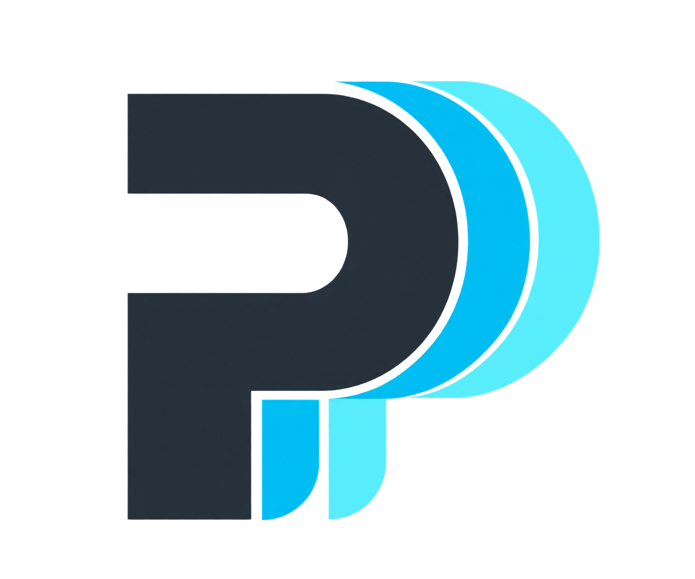
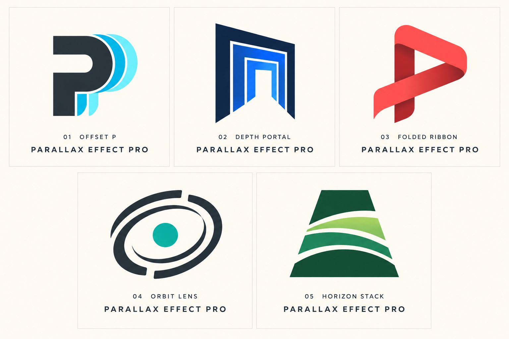

# Logo options

**Selected: 01 — Offset P.** The user selected this direction on 2026-10-07.



The transparent PNG is used in the README. The comparison below preserves all five original concepts.



1. **Offset P — recommended.** A layered P monogram makes the parallax relationship immediately visible and gives the skill a compact identity.
2. **Depth Portal.** Nested perspective frames emphasize moving through a continuous spatial story.
3. **Folded Ribbon.** A continuous P-shaped ribbon emphasizes choreography and connected transitions.
4. **Orbit Lens.** Offset rings and a focal point emphasize camera motion and selective focus.
5. **Horizon Stack.** Layered horizons emphasize landscape depth and approaching a subject.

SVG, monochrome, and dedicated small-icon variants are not included.

## Selected-logo export

The built-in imagegen tool used the comparison sheet as its edit reference. Export instructions: isolate option 01, preserve its P silhouette, proportions, layered spacing and graphite/cyan colors; remove all labels and other concepts; center the symbol with even padding on a transparent background.

## Generation prompt

Created with the built-in imagegen tool as one comparison sheet. The prompt below records the intended direction; production exports still need refinement and small-size checks.

```text
Use case: logo-brand.
Create one polished logo exploration presentation sheet containing EXACTLY FIVE distinctly different logo options for "Parallax Effect Pro", a coding-agent skill for creative continuous spatial storytelling, layered depth, scroll choreography, persistent subjects and cinematic reveals.
Single landscape canvas, warm ivory background, clean editorial layout with FIVE equal cells: three across top, two centered below. Give every cell ample white space. Each cell shows a large original vector-style SYMBOL and small restrained typography below: its option number and concept name, then "PARALLAX EFFECT PRO". Typography crisp, exactly spelled, no extra text. Symbols should work at small app-icon size and as one-color logos. Flat graphic design, geometric and precise, no photographic mockups, no drop shadows, no glossy 3D, no random sparkles, no generic AI robot.
Five options:
01 "Offset P": strong uppercase P monogram from three crisp offset layered silhouettes, subtle cyan edge gives parallax displacement, dark graphite body.
02 "Depth Portal": nested offset perspective frames forming a deep geometric doorway, dark navy plus electric blue, distinctive open negative-space corridor.
03 "Folded Ribbon": single continuous coral/red ribbon tracing an abstract P through foreground and background, graphic overlap conveys continuous motion, not an infinity symbol.
04 "Orbit Lens": dark graphite broken concentric ellipses around a small teal focal point, two shifted planes imply camera orbit and selective reveal, not a planet logo.
05 "Horizon Stack": three minimal curved horizon bands crossing a single angular aperture, forest green and lime accent, layered scenery moving toward viewer.
Keep optical weight and symbol size consistent across cells. Premium developer-tool identity, readable at a glance. Present real logo marks, no illustrative scenes. Five proposals only, no selected winner.
```
